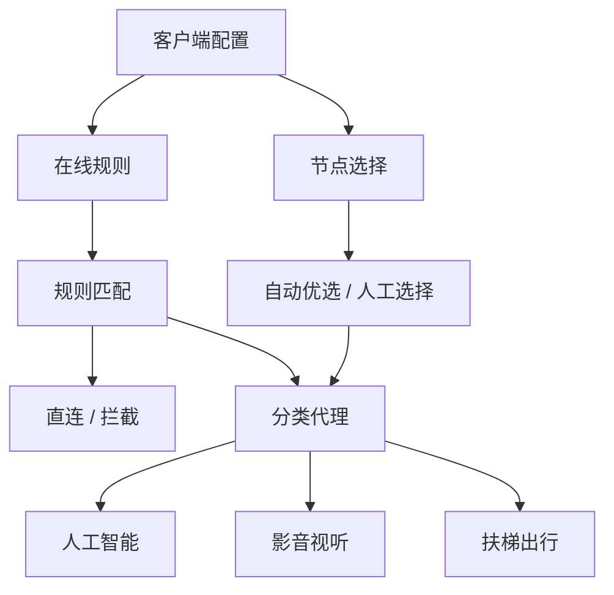

<div align="center">

# External


**Mihomo / Clash 与 Shadowrocket 智能分流配置及在线规则集**

统一桌面与移动端分流，配置统一管理节点与流量，自动选路，在线规则持续维护并定期更新。

</div>



## 配置

| 客户端          | 配置文件                                                | 作用             |
| ------------ | --------------------------------------------------- | -------------- |
| Clash Parser | [`ParsersforClash.yml`](config/ParsersforClash.yml) | 处理订阅、自动优选、分类分流 |
| Shadowrocket | [`shadowrocket.conf`](config/shadowrocket.conf)     | 远程配置、自动优选、分类分流 |

## 使用

### Clash Parser

[`ParsersforClash.yml`](config/ParsersforClash.yml) 是订阅预处理配置，不是普通 Clash 配置文件。

1. 打开支持 Parser 的 Clash 客户端
2. 进入 Parser 配置编辑页面
3. 将 [`ParsersforClash.yml`](config/ParsersforClash.yml) 的完整内容复制进去
4. 保存
5. 刷新原有机场订阅

无需修改原有订阅地址，Parser 会在订阅更新时自动处理节点、策略组及分流配置。

### Shadowrocket

[`shadowrocket.conf`](config/shadowrocket.conf) 可作为远程配置直接导入。

1. 打开 Shadowrocket「配置」
2. 点击右上角 `+`
3. 粘贴：

```text
https://raw.githubusercontent.com/akaspyrean/external/main/config/shadowrocket.conf
```

4. 下载并选择该配置
5. 点击「使用配置」

后续通过更新配置即可获取最新版。

## 规则

| 类型   | YAML                               | LIST                               |
| ---- | ---------------------------------- | ---------------------------------- |
| 直连   | [`direct.yaml`](rules/direct.yaml) | [`direct.list`](rules/direct.list) |
| 代理   | [`proxy.yaml`](rules/proxy.yaml)   | [`proxy.list`](rules/proxy.list)   |
| 智能 | [`ai.yaml`](rules/ai.yaml)         | [`ai.list`](rules/ai.list)         |
| 影音   | [`media.yaml`](rules/media.yaml)   | [`media.list`](rules/media.list)   |
| 广告   | [`ad.yaml`](rules/ad.yaml)         | [`ad.list`](rules/ad.list)         |

* `.yaml`：供 Clash / Mihomo 规则提供者使用
* `.list`：供 Shadowrocket 等文本规则客户端使用
* 两种格式由同一规则源生成，保持同步
* 规则集持续自动维护，无需手动更新

## 分流

```text
直连规则        → DIRECT
广告规则        → REJECT
人工智能        → 人工智能
影音规则        → 影音视听
代理规则        → 扶梯出行
未匹配流量      → 扶梯出行
```

代理策略仅包含：

```text
自动优选
人工选择
```

`DIRECT` 仅由规则层控制，不进入代理策略组。

## 维护

规则集通过自动化流程持续更新，并同时维护：

* Direct
* Proxy
* AI
* Media
* Ad
* YAML / LIST 格式同步
* 规则数量统计

客户端按配置设定定期获取最新规则。

## 许可

[MIT License](LICENSE)

## 声明

本仓库仅用于网络配置、规则维护与技术研究。

使用者应自行确认相关配置、规则及网络服务符合所在地法律法规及服务条款。
